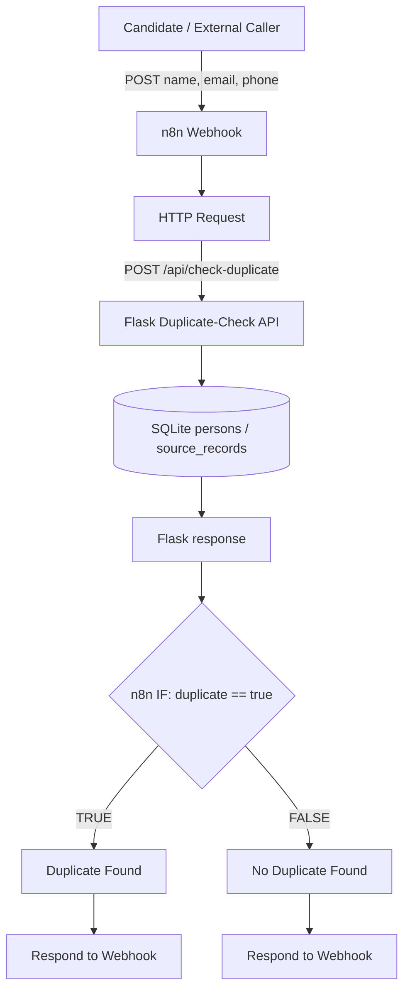
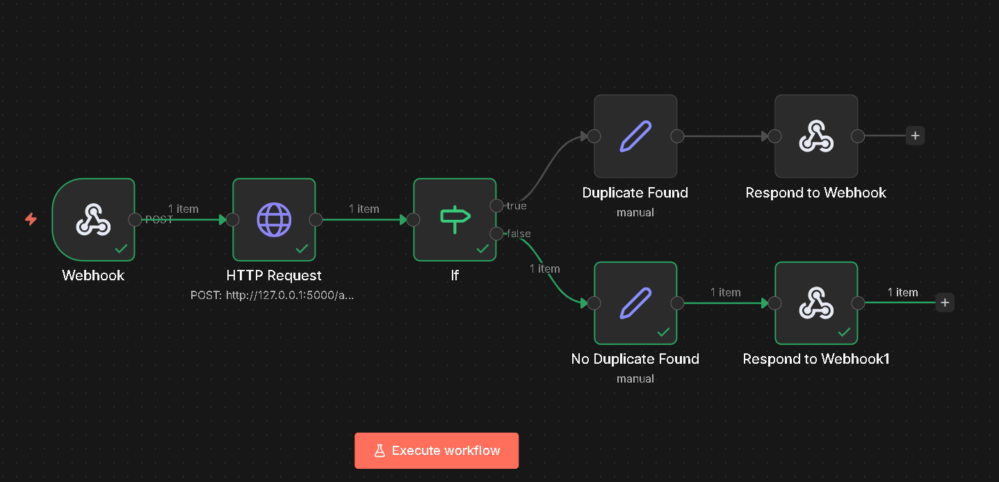

# ConsultBae AI Automation

## Project overview

This local prototype turns three inconsistent worker-data CSV exports into an
auditable canonical SQLite database, accepts worker audio uploads, extracts
technical audio metadata, exposes submissions in a small Flask dashboard, and
provides a read-only duplicate-check API used by an exported n8n workflow.

The matching policy is intentionally conservative: an exact valid normalized
email or phone is strong identity evidence; a name or city is not. Ambiguous
and invalid source rows are preserved without being attached to a person.

This repository is a local assignment implementation. It is not deployed and
does not include production authentication, cloud storage, or browser recording.

## End-to-end architecture

```text
Three immutable CSV files
  -> inspection and normalization
  -> conservative entity resolution + audit artifacts
  -> SQLite: persons + source_records
  -> Flask application
       |-> audio upload -> FFprobe/FFmpeg -> audio_submissions + local file
       |-> submissions dashboard + controlled playback
       `-> POST /api/check-duplicate (read-only persons lookup)
             ^
             `-> n8n webhook -> HTTP Request -> IF -> response branch
```

Raw records and normalized comparison values remain separate. The generated
matching audit explains every decision before ingestion persists it.

## Repository structure

```text
data/raw/                 Immutable input CSV files
data/processed/           Generated reports and local SQLite database
docs/                     Data-quality, design-decision, and debugging records
src/ingestion/            Read-only profiling and targeted investigation
src/matching/             Shared normalization and entity-resolution rules
src/database/             Schema, deterministic ingestion, and inspection
src/audio/                FFprobe/FFmpeg metadata extraction
src/app/                  Flask routes, templates, and static assets
tests/                    Focused and integration tests
uploads/audio/            Runtime audio files; contents are ignored by Git
workflows/n8n/            Exported n8n workflow JSON
```

## Prerequisites and setup

Install:

- Python 3.10 or newer (the final audit used Python 3.12.1)
- FFmpeg and FFprobe available on `PATH`
- Node.js, npm, and npx if running n8n locally

Create a virtual environment, activate it, and install Python dependencies:

```bash
python -m venv .venv
```

Windows PowerShell:

```powershell
.\.venv\Scripts\Activate.ps1
python -m pip install -r requirements.txt
```

macOS/Linux:

```bash
source .venv/bin/activate
python -m pip install -r requirements.txt
```

Verify the external tools:

```bash
ffmpeg -version
ffprobe -version
node --version
npm --version
npx --version
```

On Windows, reopen the terminal after adding FFmpeg to `PATH`.

## Build and inspect the data pipeline

Optional read-only source profiling and investigation:

```bash
python -m src.ingestion.inspect_data
python -m src.ingestion.investigate_records
```

Generate the Phase 2 matching audit:

```bash
python -m src.matching.generate_report
```

Build the canonical database:

```bash
python -m src.database.ingest
```

The deterministic ingestion baseline is 105 source rows, 53 canonical people,
84 linked rows, and 21 unresolved rows. Ingestion builds and validates a
temporary database before atomically replacing the target. It refuses to
rebuild if audio submissions exist, preventing non-reproducible app data from
being silently discarded.

Inspect counts, provenance samples, and unresolved rows:

```bash
python -m src.database.inspect_db
```

## Run the Flask application

Ensure the database has been initialized, then run either command:

```bash
python -m src.app.app
```

```bash
flask --app src.app.app run
```

Open `http://127.0.0.1:5000`.

### Audio submission workflow

The worker supplies a name, a valid phone, and a WAV, MP3, M4A, OGG, or WebM
file up to 25 MB. The app reuses the Phase 2 phone normalizer:

- one canonical-phone match links the submission to that person;
- no phone match creates a minimal new person and links the submission;
- multiple canonical matches return a manual-review conflict;
- an invalid phone, unsupported file, unreadable audio, or failed analysis is
  rejected without leaving a person, submission, or uploaded file behind.

Files receive UUID-based stored names under `uploads/audio/`, so equal original
filenames cannot overwrite each other.

### Audio metadata

FFprobe reads the first audio stream and supplies:

- `duration_seconds`
- `sample_rate_hz`
- `bitrate_bps` (stream bitrate, with container bitrate as fallback)

FFmpeg's `volumedetect` filter supplies `loudness_db`. This field is FFmpeg's
`mean_volume` in dB relative to digital full scale (dBFS-style); it is not LUFS
or EBU R128 integrated loudness.

### Dashboard and playback

Open `http://127.0.0.1:5000/submissions`. Rows are newest first and show the
submitted and canonical identity, file information, browser playback, metadata,
and timestamp. Playback uses `/audio/<stored_filename>`: the route requires a
matching database record and serves only from the configured upload directory.
Unknown, missing, and traversal-style paths return 404.

## Duplicate-check API

`POST /api/check-duplicate` performs a read-only lookup against canonical
`persons`. It never creates or modifies people, source rows, or audio submissions.
Name is accepted as context but cannot cause a duplicate match; city is not
required.

Example:

```bash
curl -X POST http://127.0.0.1:5000/api/check-duplicate \
  -H "Content-Type: application/json" \
  -d '{"name":"Tanvi Gupta","email":"tanvi.gupta31@example.com","phone":"9000000254"}'
```

| HTTP | Status | Meaning |
|---:|---|---|
| 200 | `MATCHED_HIGH_CONFIDENCE` | A valid email and/or phone identifies one canonical person. |
| 200 | `NO_MATCH` | Neither valid strong identifier resolves to a person. |
| 409 | `AMBIGUOUS_REVIEW` | Email and phone resolve to different people; no guess is made. |
| 400 | `INVALID_REQUEST` | JSON is malformed/not an object, no strong identifier was supplied, or none is valid. |

Matched response example:

```json
{
  "duplicate": true,
  "status": "MATCHED_HIGH_CONFIDENCE",
  "person_id": 1,
  "matched_by": ["phone", "email"],
  "canonical_name": "Tanvi Gupta"
}
```

## n8n Automation Architecture

The exported workflow is
[`workflows/n8n/duplicate_candidate_check.json`](workflows/n8n/duplicate_candidate_check.json).



Component responsibilities:

- **n8n** handles workflow orchestration.
- **Webhook** is the automation entry point for candidate identity data.
- **HTTP Request** calls the Flask duplicate-check API.
- **Flask** contains the duplicate-check and validation business logic.
- **SQLite** contains persisted canonical and source identity data.
- **IF** performs the low-code `duplicate == true` branch decision.
- **Respond to Webhook** returns the final result to the external caller.

Run Flask and n8n simultaneously in separate terminals. For local n8n:

```bash
npx n8n
```

In n8n, choose **Import from File** and select the workflow JSON. Review the
HTTP Request URL after import. `http://127.0.0.1:5000` works when n8n runs on the
same host; containerized or remote n8n requires a host-reachable Flask address.
No credentials are included in the export.

n8n exposes two webhook modes:

- **Test URL:** [http://localhost:5678/webhook-test/check-duplicate](http://localhost:5678/webhook-test/check-duplicate)
  requires **Listen for test event** to be active in the editor.
- **Production URL:** [http://localhost:5678/webhook/check-duplicate](http://localhost:5678/webhook/check-duplicate)
  works without the test listener when the workflow is published and active.

The webhook is configured to respond through the branch-specific **Respond to
Webhook** nodes. Flask must be running or the HTTP Request node will fail.

### n8n Workflow



The screenshot shows the Webhook → HTTP Request → IF → Duplicate/No Duplicate
→ Respond to Webhook workflow.

## Data quality and matching approach

The raw dataset has 105 rows across three incompatible schemas. Normalization
trims text, normalizes case/spacing, validates and lowercases email, and removes
limited phone punctuation plus an Indian `+91`/`91` prefix only when exactly ten
digits remain. City is supporting context only.

Exact valid normalized email and phone are strong evidence. Name-only matches
remain unresolved because repeated names such as Arjun Mehta and Deepak Nair
have conflicting identifiers. If strong identifiers disagree, neither wins.
The pipeline preserves every raw row, normalized fields, reasons, evidence,
candidate IDs, and complete source JSON. See
[`docs/data_quality_report.md`](docs/data_quality_report.md) and
[`docs/decisions.md`](docs/decisions.md).

## Testing

Run the complete suite:

```bash
python -m pytest
```

Final audit on 21 August 2026: **72 passed, 2 skipped in 6.30s**. The two skipped
tests are FFmpeg/FFprobe integration tests guarded when those executables are
unavailable on the test machine; unit tests still cover parsing, errors, cleanup,
and routes. Re-run with both executables on `PATH` to exercise the integrations.

## Design decisions and known limitations

Important design decisions are recorded in [`docs/decisions.md`](docs/decisions.md),
and implementation problems in [`docs/stuck_log.md`](docs/stuck_log.md).

Current limitations:

- local Flask development server, SQLite database, and filesystem audio storage;
- no authentication, authorization, encryption policy, or multi-tenant boundary;
- no browser microphone recording or background processing;
- deliberately basic email syntax validation and India-focused phone handling;
- ambiguous records require human review and there is no review UI;
- FFmpeg mean volume is not perceptual LUFS analysis;
- n8n and Flask must be started separately and the workflow URL is environment-specific;
- no cloud deployment, production monitoring, or automated backup process.

## Scaling toward approximately 5,000 workers

The current implementation is appropriate for a local assignment, not the
future production architecture. For concurrent use, migrate SQLite to
PostgreSQL with unique/partial constraints and indexes on normalized email,
phone, source-row keys, status, and foreign keys. Store audio in private object
storage using short-lived signed access rather than on the Flask host.

Move FFmpeg work to a background job queue with retries, timeouts, idempotency
keys, and explicit processing states. Serve the app through a production WSGI
server and reverse proxy, and deploy n8n with durable PostgreSQL-backed state.
Add authentication, role-based authorization, rate limits, input/content
security checks, audit logs, structured metrics/traces, alerting, encrypted
secrets, retention/privacy controls, tested backups, and disaster recovery.
Webhook and submission requests should carry stable idempotency keys so retries
cannot create duplicate effects.

## Loom/demo

**Placeholder — replace before submission:** `<FINAL_LOOM_URL>`

The demo should show source irregularities, matching evidence, database counts,
an audio upload and dashboard playback, duplicate and no-match API calls, both
n8n branches, the test-versus-production webhook behavior, and the passing test
suite. Do not claim a deployed environment; demonstrate the local services.
